# VPN Site-to-Site Tunnel Configuration

## Project Overview

This project demonstrates the configuration of a secure Site-to-Site VPN tunnel between two routers to allow secure communication between two different internal networks.

The lab involved configuring routing, testing connectivity, and establishing an encrypted tunnel between routers.

---

## Lab Environment

Routers used:

- Router R1
- Router R2
- Router R3

Network ranges used in the lab:

| Router | Network |
|------|------|
| R1 | 192.168.1.0 |
| R3 | 192.168.2.0 |

Router R2 acted as the intermediate router between the two networks.

---

## Network Topology

The network topology used in this lab consists of three routers and two internal networks connected through an intermediate router. The VPN tunnel is created between Router R1 and Router R3 to securely connect the two networks.

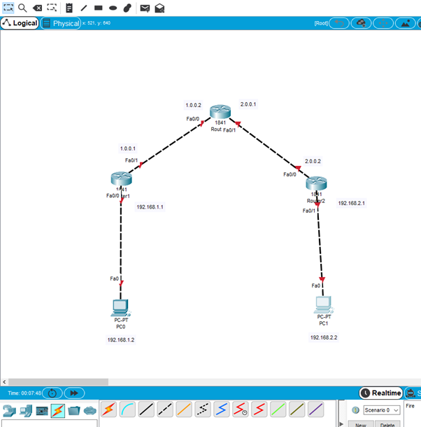

---

## Host Configuration

Before configuring the routers and VPN tunnel, the end devices were configured with appropriate IP addresses so they could communicate with their respective local routers.

### PC0 Configuration

PC0 was configured with the following network settings:

- IP Address: 192.168.1.2
- Default Gateway: 192.168.1.1

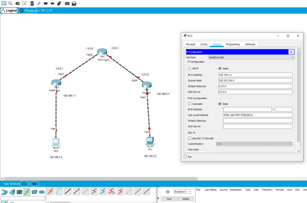

### PC1 Configuration

PC1 was configured with the following network settings:

- IP Address: 192.168.2.2
- Default Gateway: 192.168.2.1

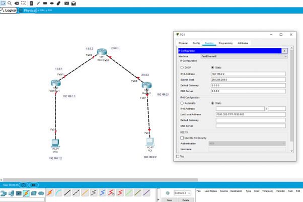

---

## Step 1 — Configure Router Interfaces

Each router interface was configured with IP addresses to enable connectivity between the routers.

Routers configured:

- Router R1
- Router R2
- Router R3

---

## Router Configuration

After configuring the end hosts, the routers were configured with IP addressing and interfaces to enable communication between networks.

### Router R1 Configuration

Router R1 connects the internal network 192.168.1.0 to the intermediate router.

Key configuration tasks included:

- Accessing router configuration mode
- Configuring the FastEthernet interface
- Assigning IP addresses
- Activating the interface

Example configuration steps:

enable  
configure terminal  
interface fastethernet0/1  
ip address 1.0.0.1 255.0.0.0  
no shutdown  

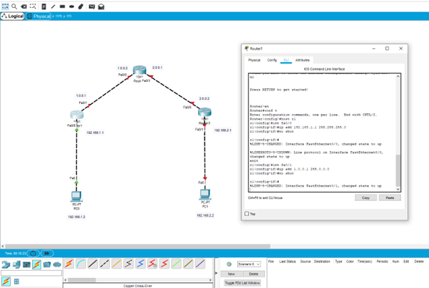

---

### Router R2 Configuration

Router R2 acts as the intermediate router between Router R1 and Router R3. It is responsible for forwarding traffic between the two routers and ensuring proper network connectivity.

Configuration tasks included:

- Assigning IP addresses to router interfaces
- Enabling interfaces
- Allowing routing between connected networks

Example configuration steps:

enable  
configure terminal  
interface fastethernet0/0  
ip address 1.0.0.2 255.0.0.0  
no shutdown  

interface fastethernet0/1  
ip address 2.0.0.1 255.0.0.0  
no shutdown  

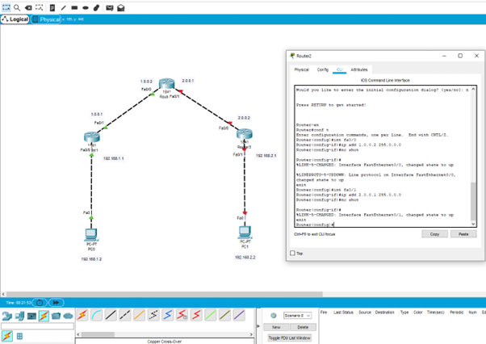

---

### Router R3 Configuration

Router R3 connects the second internal network (192.168.2.0) to the intermediate router R2.

Configuration tasks included:

- Assigning IP addresses to interfaces
- Enabling router interfaces
- Preparing the router for VPN tunnel configuration

Example configuration commands:

enable  
configure terminal  
interface fastethernet0/1  
ip address 2.0.0.2 255.0.0.0  
no shutdown  

interface fastethernet0/0  
ip address 192.168.2.1 255.255.255.0  
no shutdown  

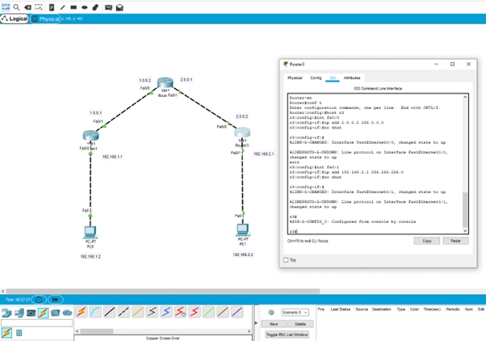

---

## Step 2 — Configure Default Routing

Routing entries were added to allow traffic to reach remote networks.

Example configuration:

ip route 192.168.2.0 255.255.255.0 172.16.1.2

This route directs traffic destined for the 192.168.2.0 network through the gateway.

## Routing Configuration

After configuring the routers, static routing was configured to allow communication between the two internal networks.

Static routes were added on Router R1 and Router R3 so that traffic destined for the remote network could be forwarded correctly.

### Default Routing on Router R1

Router R1 was configured with a route directing traffic for the 192.168.2.0 network toward the intermediate router.

Example command used:

ip route 192.168.2.0 255.255.255.0 172.16.1.2

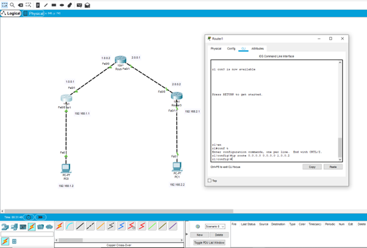

---

### Default Routing on Router R3

Router R3 was configured with a route directing traffic for the 192.168.1.0 network back toward Router R1 through the intermediate router.

Example command used:

ip route 192.168.1.0 255.255.255.0 172.16.1.0

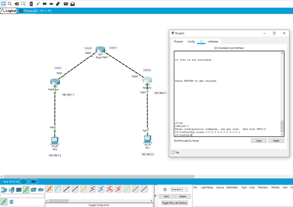

---

## Step 3 — Connectivity Testing

Connectivity between routers was tested using ping commands.

Tests performed included:

- Router3 pinging Router2
- Router2 pinging Router3
- Router3 pinging external addresses

These tests confirmed that the routing configuration was working.

---

### Router3 Ping Test

Router3 was used to test connectivity by sending ICMP ping requests to another network address.  
The successful replies confirmed that routing between the routers was working correctly.

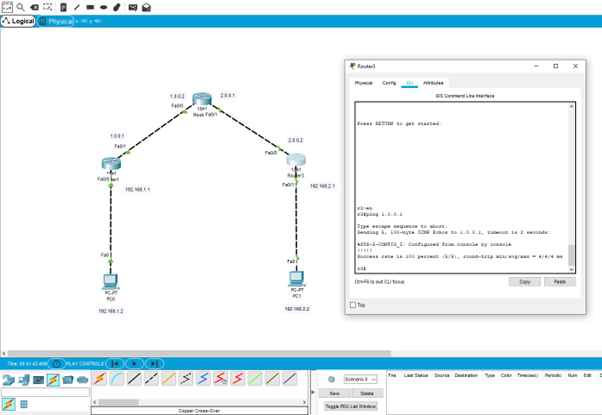

---

### Router2 to Router3 Communication

Connectivity between Router2 and Router3 was verified using ICMP ping commands.

Successful responses confirmed that traffic could travel between the routers through the configured routing paths.

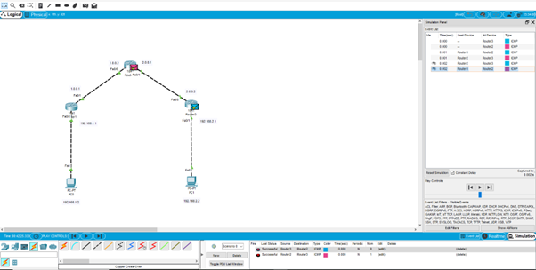

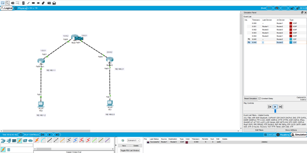

---

### Additional Connectivity Verification

Additional packet tests were performed in the Packet Tracer simulation environment to confirm successful routing across the network.

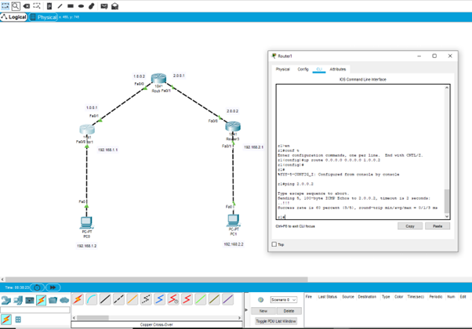

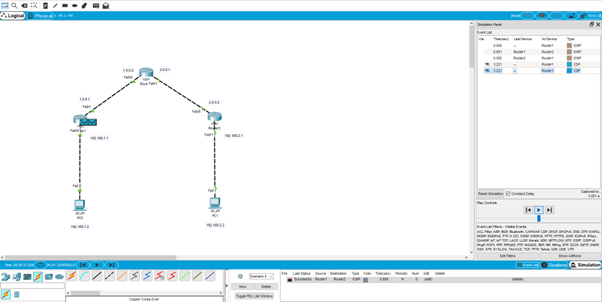

## Step 4 — VPN Tunnel Configuration

After verifying that basic connectivity and routing were functioning correctly, a VPN tunnel was created between Router R1 and Router R3 to securely connect the two remote networks.

The tunnel was configured on both routers using tunnel interfaces and appropriate IP addressing.

### VPN Tunnel Configuration on Router R1

Router R1 was configured with a tunnel interface that points to Router R3 as the tunnel destination.

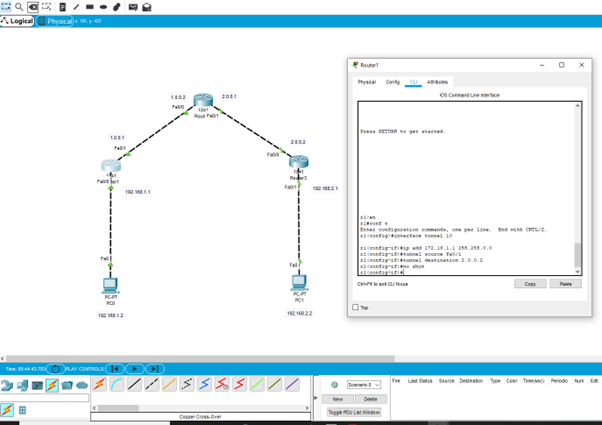

---

### VPN Tunnel Configuration on Router R3

Router R3 was configured with a corresponding tunnel interface that points back to Router R1.

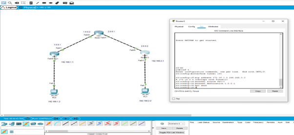

---

## Step 5 — Tunnel Verification

After configuring the VPN tunnel, connectivity tests were performed to verify that the tunnel was successfully established.

### Initial Test (Before Tunnel Fully Established)

An initial connectivity test from Router R1 to Router R3 resulted in packet loss, indicating that the tunnel was not yet fully operational.

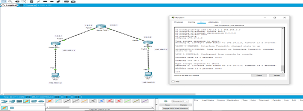

---

### Successful Tunnel Communication

After completing the configuration, the routers were able to communicate successfully through the VPN tunnel.

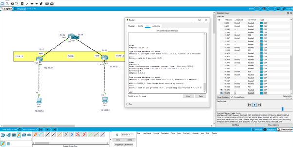

---

### Router R3 Connectivity Test

Router R3 successfully communicated with Router R1 across the VPN tunnel, confirming that the encrypted connection was functioning correctly.

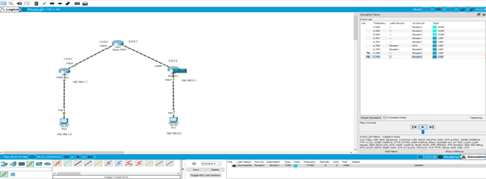

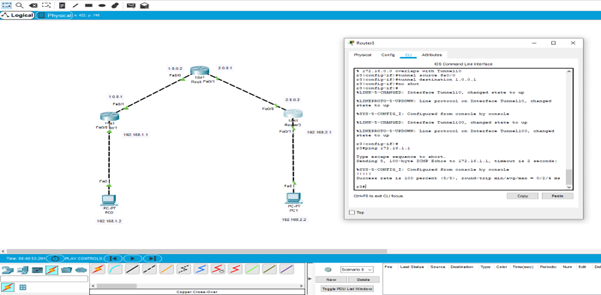

---

## Step 6 — Routing Through the Tunnel

Additional static routes were configured on both routers to ensure that traffic between the two internal networks travels through the VPN tunnel.

### Static Route on Router R1

Example configuration command:

R1(config)# ip route 192.168.2.0 255.255.255.0 172.16.1.2

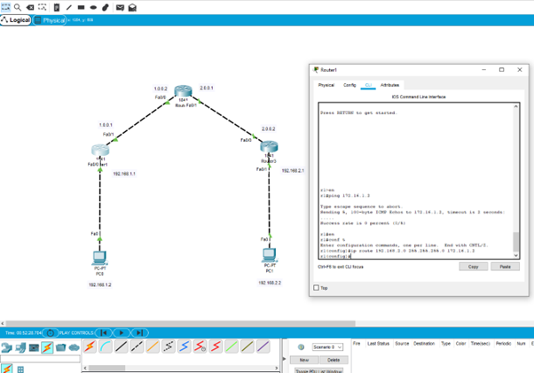

---

### Static Route on Router R3

Example configuration command:

R3(config)# ip route 192.168.1.0 255.255.255.0 172.16.1.0

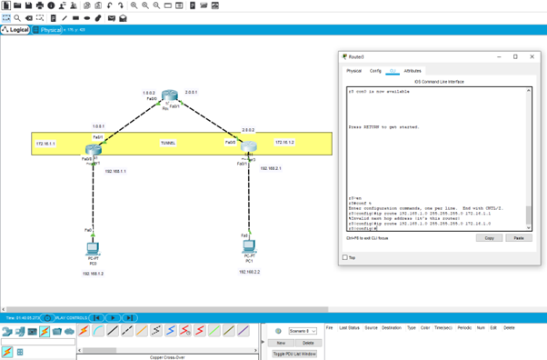

---

## Step 7 — VPN Tunnel Testing

Further tests were performed to confirm that the VPN tunnel was functioning correctly.

### Router R1 Tunnel Verification

Router R1 was used to verify that the VPN tunnel interface was successfully created and operational.

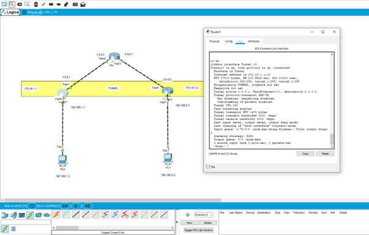

---

### Router R3 Tunnel Verification

Router R3 also confirmed successful tunnel creation and communication.

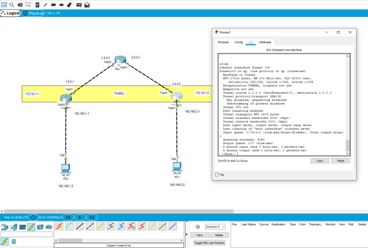

---

### Packet Flow Through Tunnel

Simulation mode in Packet Tracer was used to trace the packet flow through the VPN tunnel and verify that traffic was being routed correctly.

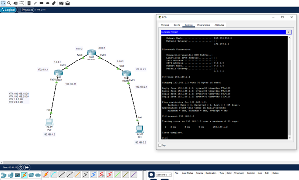

---

## Result

The VPN tunnel was successfully established between Router R1 and Router R3, allowing secure communication between the two networks.

---

## Skills Demonstrated

- Network routing
- Router configuration
- VPN implementation
- Network troubleshooting
- Secure network communication
